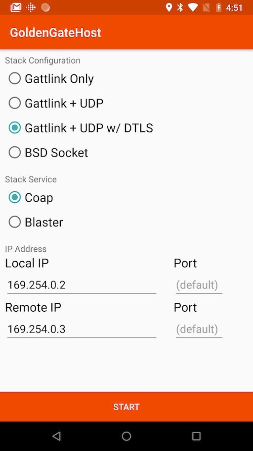
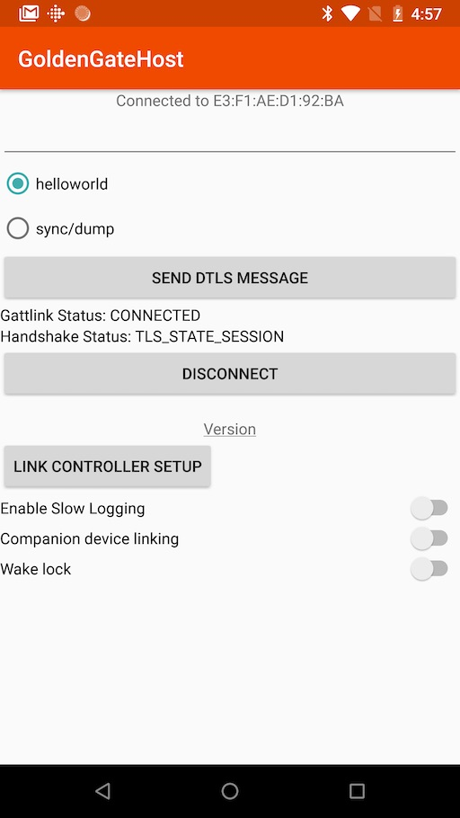

Android Host App
================

The Android Host App is a simple app that offers a very basic user interface to
allow scanning, connecting to and interacting with another device or app over
Bluetooth.

Screens
-------

### Main Screen

This screen is what you see when you launch the app.  
On that screen, select a stack configuration from the "Stack Configuration"
choices, and a service type from the "Stack Service" choices.

!!! danger
    Don't change the IP Address values, unless you know exactly what you're
    doing and you have a specific need to do that. The default values are
    what you need in almost all cases.

{: style="width:256px"}

### Scan Screen

The "Scan" screen allows you to scan for compatible devices that are 
advertising. Each device appears in a list with its advertised name and
signal strength. To select a device to pair with, just tap on its entry in the 
list.

{: style="width:256px"}

### Interaction Screen

The "Interaction" screen allows you to interact with a connected peer.  
When using the CoAP service mode, you can send a CoAP request to the peer.  
When using the Blast service mode, you can start/stop the performance test
blast with the peer.  

{: style="width:256px"}
