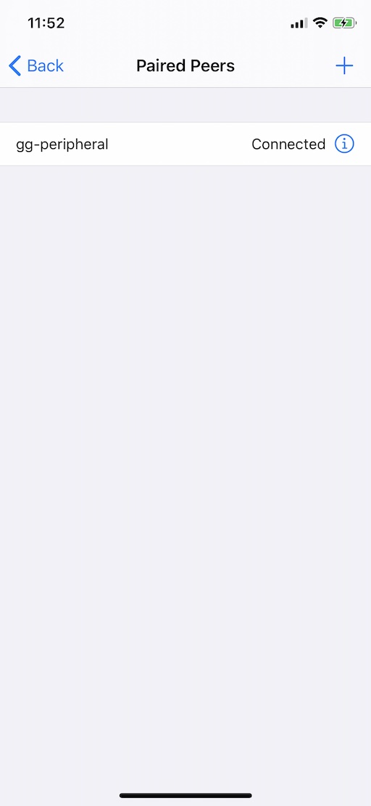
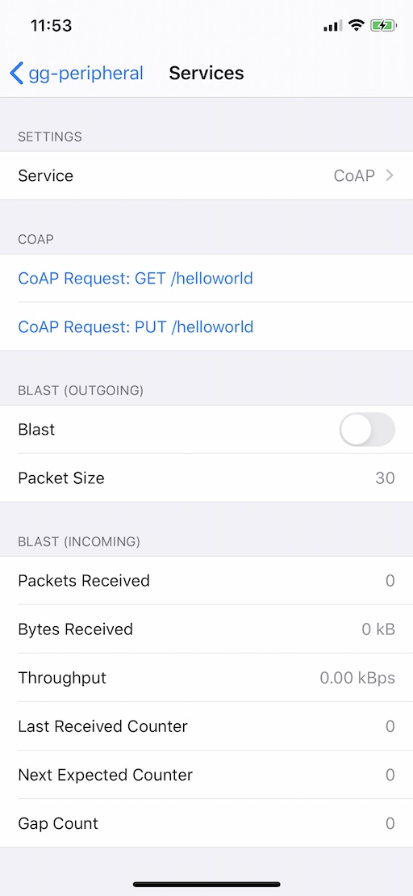
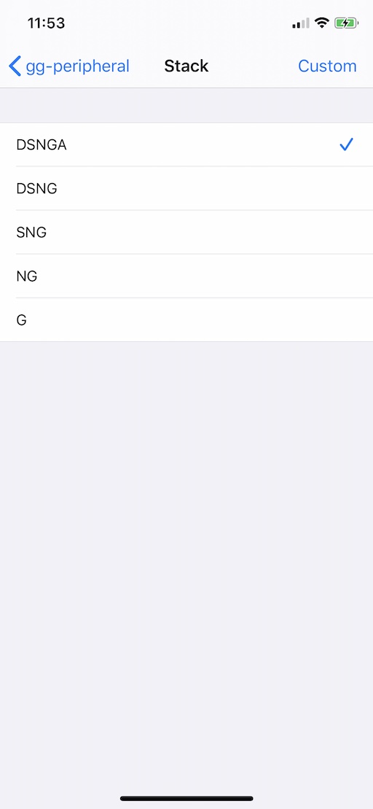
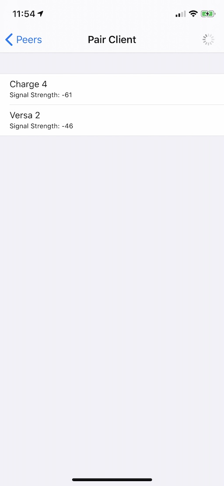

iOS Host App
============

The iOS Host App is a simple app that offers a very basic user interface to
allow scanning, connecting to and interacting with another device or app over
Bluetooth.

Screens
-------

### Main Screen

This screen is what you see when you launch the app. It shows some of the 
build configuration information, and a "Paired Peers" navigation button that
takes you to the "Paired Peers" screen.

{: style="width:256px"}

### Paired Peers Screen

This screen shows a list of paired peers and their status. You can add a peer
to the list by tapping the :heavy_plus_sign: button.

You can tap the :information_source: button to go to the "Peer" screen and
interact with the peer.

!!! note
    The term "paired" here doesn't refer to Bluetooth pairing and bonding, it
    just means that it is a peer that has been found and saved in a list of
    peers

{: style="width:256px"}

### Peer Screen

This screen allows you to configure the stack used to communicate with the 
peer, and see some of the parameters of the current connection.

The "Stack" navigation button is used to navigate to a screen where you can
select the stack configuration you want.

The "Services" navigation button takes you to the "Services" screen where you
can select what services will be connected through the stack.

The "Connect" toggle can be used to connect to / disconnect from the peer.

!!! note
    Any change in stack configuration or service type must be done prior to
    connecting. Once connected, those cannot change.

{: style="width:256px"}

### Services Screen

This screen allows you to interact with the peer. Depending on the service
that you have selected. Use the "Service" navigation button to select between:

  * None - no service (the stack is configured, but no service is attached to it)
  * CoAP - a CoAP server and client are attached to the stack
  * Blasting - a "blast" performance test service is attached to the stack

{: style="width:256px"}

#### CoAP

When the selected service is "CoAP", the COAP section of the screen allows you
to send a CoAP request to the peer, and any response received back will be 
displayed in a popup.

#### Blast

When the selected service is "Blast", the "Blast" toggle can be used to 
start/stop blasting packets to a blast receiver.  
The "Packet Size" option lets you select the packet size when blasting, from 
30 bytes to 1000 bytes.

### Stack Screen

This screen lets you select the stack configuration you want.
The available stack configurations are:

  * `G` - Just Gattlink
  * `NG` - Same as `G` + Network Interface
  * `SNG` - Same as `NG` + UDP Socket
  * `DSNG` - Same as `SNG` + DTLS
  * `DSNGA` - Same as `DSNG` + Traffic Analyzer (default choice)

{: style="width:256px"}

### Pair Screen

The "Pair" screen allows you to scan for compatible devices that are 
advertising. Each device appears in a list with its advertised name and
signal strength. To select a device to pair with, just tap on its entry in the 
list.

{: style="width:256px"}
