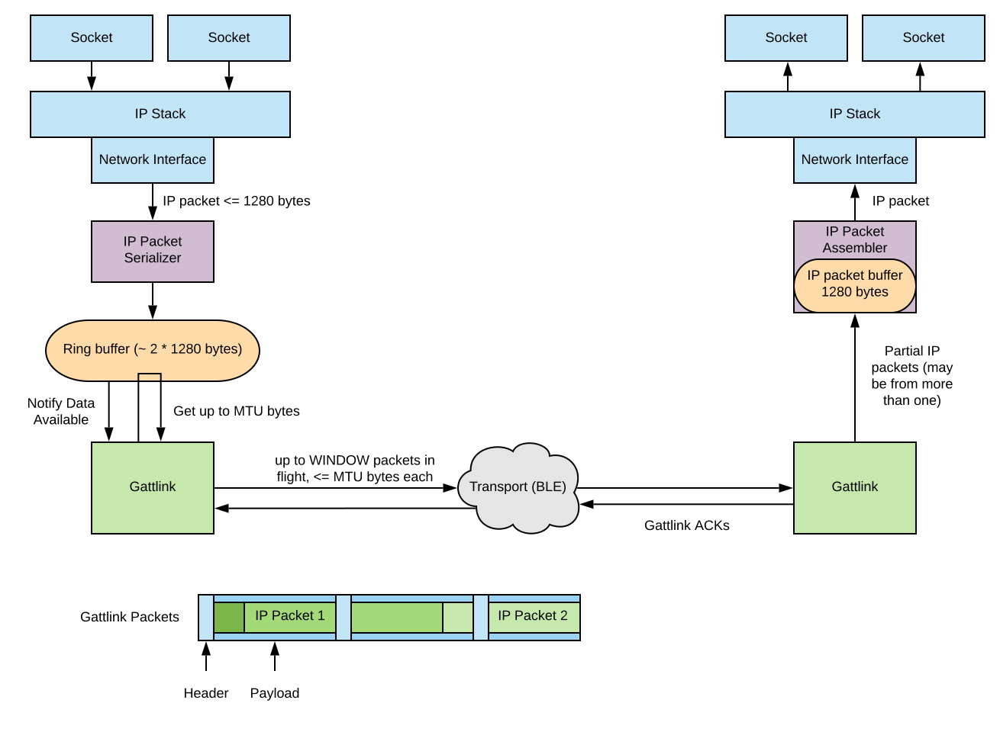

Gattlink Protocol
=================

Protocol in a nutshell

  * Control Packets
    - Used for handshake or reset during a session
    - Each peer sends a RESET packet with parameters and waits for a reset ACK
    - Parameters include version and window size
    - Timers for retries
  * Session - Data Packets
    - A packet has data only, ACK only, or both data and ACK
    - Packets with data have a Packet Sequence Number (`PSN`)
    - ACKs acknowledge the receipt of "up to" a `PSN`
    - ACKs are sent when 1/2 or more of the window needs ACK'ing, or a certain time passes (default 200ms)
    - Packets are resent when not ACK'ed for some time (default 4 seconds)
    - Consecutive missed ACKs = stall. Stall event emitted

## Handshake State Machine

             +----------+
             |          |
             |         ---
             |         any
             v         ---
      +-------------+   |
      | INITIALIZED |---+
      +-------------+
             |
             |      +-------------------------------------------------------+
          {start}   |      +------------+                                   |
             |      |      |            |                                   |
             v      v      v      --------------                            |
          ( send reset request )  on reset timer                            |
          (schedule reset timer)  --------------                            |
                    |                   |                                   |
                    v                   |                                   |
    +------------------------------------------+                            |
    |  AWAITING_RESET_COMPLETE_SELF_INITIATED  |                            |
    +------------------------------------------+             +---------+    |
              |                      |                       |         |    |
       ----------------      -----------------       ----------------- |    |
       on reset request      on reset complete       on reset complete |    |
       ----------------      -----------------       ----------------- |    |
              |                      |                       |         |    |
              |            (send reset complete)             |         |    |
              |                      |                       |         v    |
              |                      +------------>+---------------------+  |
              |                                    |        READY        |  |
     (send reset complete)           +------------>+---------------------+  |
              |                      |                       |              |
              |              -----------------        ----------------      |
              |              on reset complete        on reset request      |
              |              -----------------        ----------------      |
              v                      |                       |              |
    +------------------------------------------+             |              |
    | AWAITING_RESET_COMPLETE_REMOTE_INITIATED |   (send reset complete)    |
    +------------------------------------------+             |              |
              |           ^        |         ^               |              |
       ----------------   |  --------------  |               |              |
       on reset request   |  on reset timer  +---------------+              |
       ----------------   |  --------------                                 |
              |           |        |                                        |
    (send reset complete) |        |                                        |
              |           |        |                                        |
              +-----------+        |                                        |
                                   +----------------------------------------+

## GattLink Buffers

