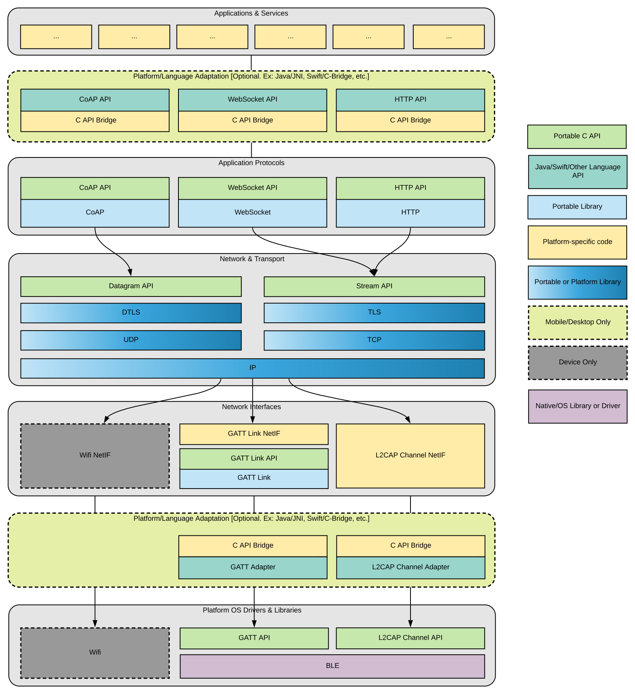

Software Architecture
=====================

Network/Protocol Stack
----------------------

!!! note "Note"
    Not all elements in this diagram are implemented in version 1 of the framework

In a network/protocol stack, is is important to have cleanly separated protocol
layers.

  * Layers are not tightly coupled, they just pass buffers to each other (see the I/O model description below)
  * Applications and services use the "top" of the stack
  * A transport, attached at the "bottom" of the stack connects two stacks together
  * Many different stack configurations can be used
  * Two connected stacks must be compatible

### Hub / Node

Two connected stacks are *mostly* symmetric. For non-symmetric elements,
we assign each stack a *role*. The *role* is also used to automatically assign
a default IP address.

  * Hub - role assumed by the mobile phone/desktop
    - DTLS server (waits for client to handshake)
    - Default IP address `169.254.0.2`
    - Host may have multiple Hub stacks
  * Node - role assumed by the tracker
    - DTLS client (initiates handshake with server)
    - Default IP address `169.254.0.3`
    - Host typically has one stack

### Link Layer

The most common link layer is Gattlink (streams over BLE GATT).
Others include:

  * L2CAP (a.k.a Connection Oriented Channels)
  * UDP over Wifi/Ethernet/Loopback (for testing, bridging)

!!! note "Support for L2CAP channels is not complete"
    The support for using L2CAP channels, which is a recently added feature
    on iOS and Android, is only experimental in the current version.

#### GattLink

Gattlink is a protocol that allows sending streams over a packet-oriented
transport with some resilience to errors

  * Designed with GATT in mind
    - Single GATT write/notify is too small to send/receive a whole IP packet
    - GATT stacks have no buffer control
  * Symmetric - two peers, no "client" or "server"
  * Buffer/flow control - windowing mechanism
  * Stall detection
  * Can run over GATT, but also other transports (L2CAP, UDP, ...)

### IP Networking

IP - The base protocol

  * IP address - each `host` has an IP address.
    - 32-bit in IPv4, written as A.B.C.D
    - "Class" - A, B, C, D, E. https://www.computerhope.com/jargon/i/ip.htm#classes
    - A netmask is a 32-bit binary mask used to divide an IP address into subnets and specify the network's available hosts. Ex: `255.255.255.0`
    - `169.254.0.0/16` is used for Link Local addresses.
  * IP packet
    - Version, Protocol, Length, Checksum. https://en.wikipedia.org/wiki/IPv4#Header
    - Source & Destination addresses

### Sockets

A socket represents a communication channel - Unique pair of (`host`/`port`, `host`/`port`)

  * UDP - Datagram-oriented communication, no guarantees
    - Source & Destination ports (16 bits, for multiplexing)
  * TCP - Stream-oriented communication, with reliable delivery
    - Source & Destination ports (16 bits, for multiplexing)
    - Windowing, retransmission
    - Client/Server

### Network Interface

A network interface sends/receives IP packets to/from a transport

  * Ethernet, Wifi, Serial, ...

### Security

All UDP traffic is protected by DTLS

  * Same as SSL/TLS, for UDP
  * PSK (Pre Shared Key) authentication
  * Diffie-Hellman key agreement
  * AES-128 CCM or AES-256 CBC for bulk ciphers

See the [Security](security.md) page for details.

I/O Model
---------

I/O model used to pass buffers from layer to layer, or object to object:

  * Asynchronous "push" model for building data pipelines
  * Abstract interface for a reference-counted buffer type: `GG_Buffer`
  * Abstract interface for a data source: `GG_DataSource`
  * Abstract interface for a data sink: `GG_DataSink`
  * Designed to work well within the GG Loop

Threading Model
---------------

### Single Threaded Model

The library uses a mostly single-threaded model. Multi-threading is avoided
whenever possible, mainly because:

  * Threads are notoriously difficult and error-prone
  * Threads use stacks
  * Threads can easily get into race conditions
  * Threads require locking shared data

### Threading Contract

The threading contract for users of the library as well as internal modules:
an object may only be used in the thread from which it was created.

  * The thread guard is used to catch violations
  * `GG_THREAD_GUARD_BIND`, `GG_THREAD_GUARD_CHECK_BINDING(object)`

A few exceptions:

  * Exceptions are explicitly marked as such
  * Functions whose role is inter-thread communication
  * Logging
  * Memory allocation
