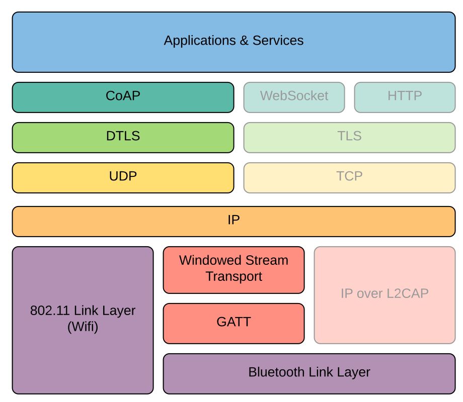

Introduction to the Golden Gate Project
=======================================

Project Goals
-------------

The goal of the Golden Gate project is to allow implementers of embedded
devices to communicate with remote (typically mobile) applications in a
way that looks and feels like the way they would do it in a traditional
networked environment, where the de-facto standard is to use web technologies
like TCP/IP for transport, TLS for security, HTTP for applications,
and other familiar protocols.

The challenge that the Golden Gate project is taking on is to offer the
familiarity and ease-of-use of those well established web technologies
on platforms where those technologies are not directly available from the
underlying operating system, but where other communication mechanisms may
exist. 

The most common case is a mobile phone communicating with an embedded
device, like a wearable or IoT device, over BLE (Bluetooth Low Energy).
While the services offered by iOS and Android phones may eventually evolve
to a model where TCP/IP is transparently offered over BLE, the situation
today is that what mobile applications are given is limited to the GATT
protocol, which may be well suited for very simple tasks like exposing
small values, such as the reading from a heart rate or temperature sensor,
but far from being a flexible transport channel like an HTTP or Web Socket
connection.  
Furthermore, targeting devices with constrained resources, where flash code
space and runtime memory is a few tens of KBs, and CPU speeds are often
below 100MHz, means that a highly optimized implementation is required,
so as to not overly limit the richness of the functionality, security,
maintainability, and robustness while staying withing strict limits.  
Finally, a secondary goal is to be able to share the bulk of the implementation
across widely different platforms, and integrate seamlessly in applications
that written in diverse programming languages on a number of distinct
operating systems.

Network Stack Approach
----------------------

The approach taken by Golden Gate to reach that goal is to implement a
core library that offers a complete network stack, with cleanly separated
layers that leverage well established standards.
On top of the stack are the applications and services that make or receive
requests. For application requests, the first supported protocol is CoAP.
CoAP is a lightweight application protocol optimized for constrained devices.
Other protocols, such as HTTP and WebSocket messages, may be implemented in
future versions.  
The requests transit through the network stack, all the way to the
bottom of the stack, where a physical transport layer is used to communicate
with a remote, peer application or service. On the peer is an equivalent stack
that the requests traverses in the reverse direction, all the way to that peer's
own set of applications and services. The responses take the reverse route all
the way back to the original client application.

!!! note "Note"
    In this diagram, the translucent boxes represent elements of the stack
    that are not yet implemented in version 1 of the framework

Applications & Services
-----------------------

Applications, in this context, are protocol clients that send requests to
services hosted on a peer device, from which they receive responses.

### CoAP

CoAP is an internet technology standard defined in [RFC7252](https://tools.ietf.org/html/rfc7252).
It offers a request/response protocol very similar to HTTP, but with a
lower processing overhead and the ability to be transported over UDP instead
of TCP. It has builtin support for reliability (even though UDP itself does
not offer that), and well-defined semantics that are very close to what
developers may be used to with HTTP, such as `GET`, `PUT`, `POST` and `DELETE`
methods, request and response headers ("options" in CoAP terminology),
numeric response status codes that map 1-1 with HTTP response status codes,
and more.  
As such, developing a rich set of interactions over CoAP is very
straightforward, without a steep learning curve.

Core Library
------------

The core library is where all the software modules needed for the layers of
the stack, as well as the runtime needed by those modules, application and
services, are implemented, in C.
The most important modules are:

| Module        | Description
----------------|---------------------------------------------
| common        | Portable runtime (memory, lists, strings, etc.)
| loop          | Loop object for scheduling asynchronous non-blocking functions
| coap          | Full-features CoAP client and server library
| lwip          | Integration of the LwIP IP stack, which may be used on platforms that don't have their own IP stacks
| netif         | Network interface modules that can be registered with the IP stacks
| sockets       | Network sockets abstraction that works with the I/O model
| tls           | DTLS protocol
| gattlink      | Gattlink protocol
| protocols     | Protocol-related functionality, like IP header compression, etc.
| stack_builder | Builder object that knows how to create and connect layers of a protocol stack based on a dynamic configuration
| remote        | Support for test automation
| services      | Collection of services, such as performance/throughput testing
| smo           | Simple object model that can model CBOR or JSON-like objects, including a CBOR parser/serializer
| utils         | Various utilities

IP
--

The choice of IP is an important choice made for the project, as it is the
de-facto standard for most network communication on the internet. It not only
gives this project a seamless way to integrate with other systems, but also
allows the reuse of a large number of well-known, proven, robust associated
protocols, such as (D)TLS, and of a wide range of vendor-supported or
open-source software components when appropriate.  
Golden Gate can be configured to work with a platform's existing IP stack,
when that is desirable, and/or may be configured to embed its own IP stack
(for which there are two flavors included in the project: one based on the
popular LwIP stack, the other a tiny UDP-only stack for cases where code size
is severely constrained).

Language Bindings
-----------------

While the core library is written in C, and may be used as-is, through its
native C API, on all platforms, it is not expected that developers writing
applications and services on operating systems where C is not a common
programming language would use that API directly.  
Instead, Golden Gate includes language-specific bindings that offer APIs
for other languages that look and feel idiomatic to those languages, and make
the right calls to the C API under the hood, transparently to the developer.
For iOS applications, there are Swift bindings. The Swift bindings go through
the automatic Swift/C bridge supported by the Apple developer platform.
For Android applications, there are Kotlin bindings, which go through JNI to
interact with the core library.

Build System
------------

In order to be buildable for a wide range of target platforms, the Golden Gate
project is structured in a way that makes it easy to:

 * Compile natively on a host platform targeting itself (macOS, Linux, Windows)
 * Cross-compile for a target platform that allows the library to be compiled
   against a platform SDK (for example iOS, Android, embedded Linux)
 * Cross-compile as a component from within a platform's build system
   (for example, Zephyr, NuttX, ESP-IDF)

The build system is based on CMake, which can generate build instructions for
a variety of build systems, and integrates very well with development
environments like Android Studio, Microsoft Visual Studio, and many embedded
development platforms like Zephyr and ESP-IDF.

Tools and Applications
----------------------

The project includes a number of useful tools and applications that either use
the core library, or are designed to work or interact with applications and
services that use the library.

### Host Applications

Two important applications included in the project are the iOS and Android
so-called [Host Applications](apps/index.md).  
Those are very simple applications, without
bells and whistle, that illustrate how to use the Golden Gate framework in an
application. They allow scanning for devices, connecting, setting up a protocol
stack, and include an example CoAP client and server.

### Embedded Application for Reference Hardware

To provide a simple, easy-to-understand example of an embedded application
that can communicate with one of the mobile host applications, the project
includes a [sample application for the MyNewt RTOS](apps/mynewt/mynewt_apps.md), 
which is configured to run on off-the-shelf nrf52840-DK development boards, 
which can be obtained online for a few dollars.  
That sample application can be configured to run as a BLE master
or slave (playing the roles of Hub or Node in Golden Gate terminology).

### Stack Tool

The [Stack Tool](tools/stack_tool.md) is a command-line application that can be 
run on Linux, macOS or Windows.  
It hosts any configuration of a Golden Gate protocol stack, connecting
the top and bottom of the stack to a native UDP socket (or directly to
Bluetooth on macOS). This allows running CoAP clients and servers, written in
any language, with any CoAP library, going through the stack running in the
stack tool process, all the way to a peer device running a compatible stack.  
This makes rapid development and prototyping of CoAP clients and servers very
easy, and lets your implement simulators or test implementations of the business
logic of your applications and services without necessarily having the final
target platforms up and running.

Support for Test Automation
---------------------------
